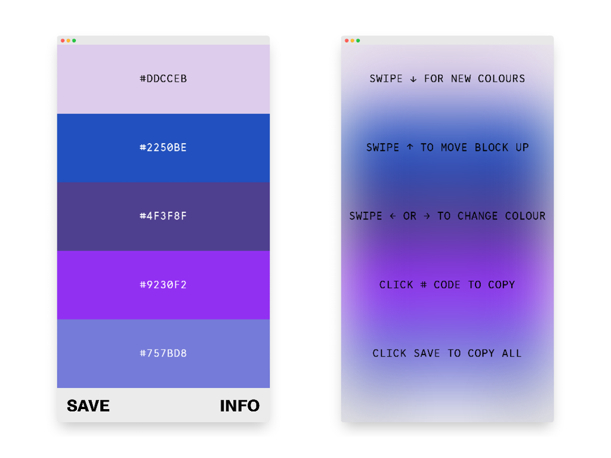

### MOBILE COLOUR SCHEME GENERATOR 🔮

Randomly generate colour schemes, adjust them, rearrange them and share them.

Built for the 🦊[Companion Studio](https://www.companion.studio/) take home challenge.

Font 1 - Trial version of [`Salmanzar`](https://www.205.tf/Font/37/salmanazar/)

Font 2 - [`Lab Mono Web`](https://github.com/hatsumatsu/Lab-Mono)

### 🧱 Features

- Swipe `down ↓` to generate a set of new colours
- Swipe `up ↑` on individual blocks to move them up
- Swipe `← left or right →` to adjust the colour of an individual block
- Click the individual `#HEX Codes` to copy it to your clipboard
- Click `save` to copy the entire set of colours to your clipboard
- Features are optimised for **mobile** - desktop has limited functionality

### 📚 What I learnt

- How to use `localStorage()` to temporarily store and retrieve data between page-loads
- How to convert `RGB` into the base16 system `HEX`
- How to `copy` data from the page to the users `clipboard`
- Used a formula to adjust `foreground` color when `background` colour is light or dark
- How to rearrange items in the `DOM`
- A basic understanding of how to implement `touch events`
- Adjust `viewport` height depending on the device (ie. take into account mobile address bar)

### 🦺 Testing

- [x] Tested on Android Firefox and Chrome
- [x] Tested in Mobile developer mode on Firefox, Chrome and Edge
- [x] Desktop version tested on Firefox, Chrome and Edge
- [ ] Saves previously generated set of colours to localstorage, but not if an individual block is modified

### ⏳ Future improvements

- [ ] Desktop version with full functionality
- [ ] Make individual colours draggable to any position
- [ ] Save colours schemes to file instead of just to clipboard
- [ ] Save colour schemes to an account for later
- [ ] Shareable a link with the colour scheme information
- [ ] Shake to generate new set of random colours
- [ ] Adjust individual colours with colour picker
- [ ] Ability to lock certain colours and refresh the rest
- [ ] Allow users to convert between different units (HSL, RGB, HEX, RAL, Name, etc)
- [ ] Allow users to have more or less than 5 colours (remove and add)

### 👀 Screenshots

